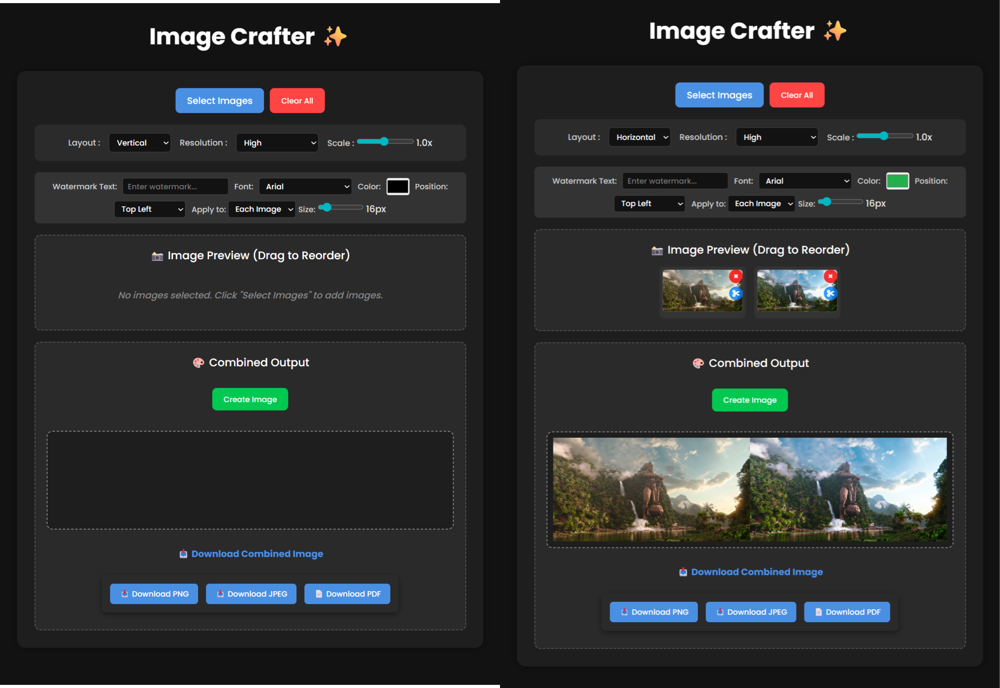

## ImageCrafter

  ImageCrafter is a sleek, user-friendly web tool that lets you combine, edit, customize, and watermark images directly in your browser — no installation or backend server needed. It’s perfect for quick tasks like merging photos for presentations, adding watermarks for social media, or preparing simple image collages for personal or professional use.

Built with clean HTML, CSS, and vanilla JavaScript, ImageCrafter runs entirely client-side, so your images never leave your device — ensuring privacy and instant processing.

## ✨ Features

  •📂 Upload multiple images (supports drag & drop reordering)

  •✂️ Crop, rotate, flip images with an interactive editor

  •🖼️ Combine images vertically, horizontally, or in a flexible grid

  •🖋️ Add custom text watermarks (position, font, color, size, custom placement)

  •🗜️ Adjust output scale and resolution (high, medium, web)

  •📥 Download combined result as PNG, JPEG, or PDF

## 📸Screenshots

Click to quick preview : https://akash098p.github.io/Image_Crafter/
## 🚀 Getting Started

Open: Open index.html in any modern web browser.

Use: Select images, crop & edit, combine, adjust watermark and output settings.

Export: Click download to save your output as PNG, JPEG, or PDF.

## ✅ Requirements

A modern web browser (Chrome, Firefox, Edge, Safari)

No installation needed

## 📜 License

MIT License .

## 👤 Author

Akash Pramanik .
